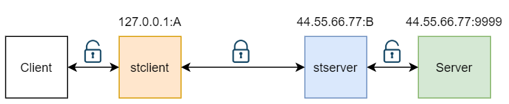

# stunnel
基本端口转发的加密安全通道，功能类似[kcptun](https://github.com/xtaci/kcptun),将非加密流量转成加密流量,包含两个配合使用的程序：stclient,stserver

## 使用
假设远程主机有个服务Server，IP:44.55.66.77 监听端口9999，本地有Client与之非加密通信</br>
<br>
为了保证数据安全,远程主机部署stserver,监听端口B,客户端主机部署stclient,监听端口A<br>
stclient将流量加密，传输至44.55.66.77:B,stserver接收流量，进行解密，将流量传送至端口9999<br>
<br>
现在localhost:A已“伪装”成44.55.66.77:9999服务了，本地Client只需要和localhost:A通信即可<br>
走在外网的全是加密流量，此时远程主机也不用暴露9999端口，只需要开放端口B

### 配置
假设端口端口A为1000，B为2000,配置如下：<br>
stclient.json:<br>
```
{
   "tunnels": [
      {
         "authkey": "abcdefg",
         "connnum": 10,
         "tcp": {
            "listen": "0.0.0.0:1000",
            "remote": "44.55.66.77:2000"
         }
      }
   ],
   "log_level": "info"
}
```

stserver.json:<br>
```
{
   "tunnels": [
      {
         "authkey": "abcdefg",
         "tcp": {
            "listen": "0.0.0.0:2000",
            "remote": "127.0.0.1:9999"
         }
      }
   ],
   "log_level": "info"
}

```
authkey代表密钥，客户端要与服务端一致<br>
connnum代表保持的连接数
 
### 启动
 stclient -c stclient.json<br>
 stserver -c stserver.json<br>
 [点此](https://github.com/0990/stunnel/releases) 下载二进制文件stclient,stserver
 
 
## 高级用法
[tcp流量支持quic,kcp传输](doc/quic-kcp.md)<br>
[udp安全通道配置](doc/udp.md)<br>
[多通道配置](doc/multi_tunnel.md)<br>

## 其它说明
tcp流量加密转发，为优化性能，tcp,quic,kcp都使用了多路复用技术<br>

## TODO
* 更多的加密方式


