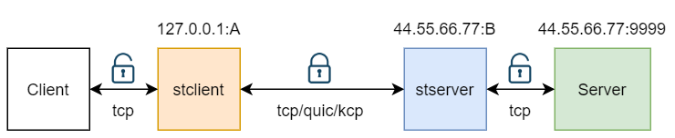

## tcp流量使用quic,kcp传输 
在网络情况不佳时，可以考虑使用可靠的udp传输协议来代替tcp的加密传输
<br>

比如stserver开启kcp,监听2001，开启quic,监听2002，<br>
stsever.json配置为
```
{
   "tunnels": [
      {
         "authkey": "abcdefg",
         "kcp": {
            "listen": "0.0.0.0:2001",
            "remote": "127.0.0.1:9999",
            "mtu": 1200,
            "sndwnd": 2048,
            "rcvwnd": 256,
            "datashard": 30,
            "parityshard": 15,
            "dscp": 46,
            "acknodelay": false,
            "nodelay": 0,
            "interval": 20,
            "resend": 2,
            "nc": 1,
            "sockbuf": 16777217,
            "streambuf": 4194304
         },
         "quic": {
            "listen": "0.0.0.0:2002",
            "remote": "127.0.0.1:9999"
         }
      }
   ],
   "log_level": "info"
}
```
stclient的kcp本地监听1001，quic的本地监听1002
```
{
   "tunnels": [
      {
         "authkey": "abcdefg",
         "connnum": 10,
         "kcp": {
            "listen": "0.0.0.0:1001",
            "remote": "44.55.66.77:2001",
            "mtu": 1200,
            "sndwnd": 256,
            "rcvwnd": 2048,
            "datashard": 30,
            "parityshard": 15,
            "dscp": 46,
            "acknodelay": false,
            "nodelay": 0,
            "interval": 20,
            "resend": 2,
            "nc": 1,
            "sockbuf": 16777217,
            "streambuf": 4194304
         },
         "quic": {
            "listen": "0.0.0.0:1002",
            "remote": "44.55.66.77:2002"
         }
      }
   ],
   "log_level": "info"
}
```

这样配置启动后，localhost:1001,localhost:1002即“伪装”成44.55.66.77:9999服务了<br>

注意上面stserver监听的端口2001，2002是udp端口，而本地监听的1001，1002是tcp端口<br>

经测试，kcp能有效的加速网络，但配置也比较复杂，详细内容参见：<br>

[kcp](https://github.com/skywind3000/kcp) 快速可靠的网络协议<br>
[kcptun](https://github.com/xtaci/kcptun) 基于 kcp-go做的高速远程端口转发 <br>

