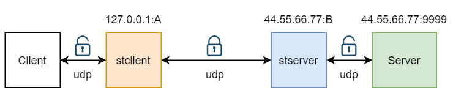

## udp安全通道配置
像支持tcp加密转发一样，同样也支持udp的加密转发
<br>
假设图中A为4000 B为4001<br>

stsever.json配置：
```
{
   "tunnels": [
      {
         "authkey": "abcdefg",
         "rawudp": {
            "listen": "0.0.0.0:4001",
            "remote": "127.0.0.1:9999",
            "timeout": 120
         }
      }
   ],
   "log_level": "info"
}
```
stclient配置：
```
{
   "tunnels": [
      {
         "authkey": "abcdefg",
         "connnum": 10,
         "rawudp": {
            "listen": "0.0.0.0:4000",
            "remote": "44.55.66.77:4001",
            "timeout": 120
         }
      }
   ],
   "log_level": "info"
}
```

这样配置启动后，localhost:4000即“伪装”成44.55.66.77:9999服务了<br>

注意上面stserver监听的端口4001，本地监听的4000，都是udp端口<br>

